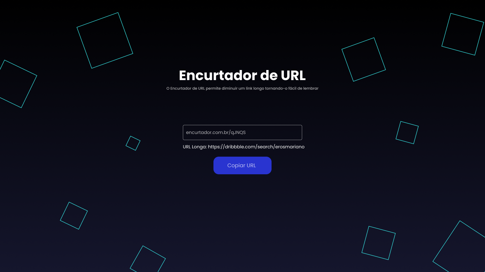

# Encurtador de URL
<h1 align="center">



</h1>

<h4 align="center"> 🚀Encurtador de URL Full-Stack🚀 </h4>

##  💻 Sobre o projeto

  
🔧Esse projeto veio das aulas da plataforma Digital Inovation One, no bootcamp da Eduzz, onde foi feito e proposto o desenvolvimento de uma API construida com Nodejs e Typescript e como extra eu implementei o Front-end.

##  🛠 Tecnologias
  

As seguintes ferramentas foram usadas na construção do projeto:

  

- [ReactJs](https://pt-br.reactjs.org)

- [StyledComponents](https://styled-components.com)

- [Typescript](https://www.npmjs.com/package/typescript)

- [Nodejs](https://nodejs.org/en/)

- [Bootstrap](https://getbootstrap.com/)

- [MongoDB]()
  
##  🚀 Como executar o projeto

  
<p>O primeiro passo é fazer o download do repositório para a sua máquina</p>

````
    git clone https://github.com/erosMariano/encurtador-url.git
````
<p>Entrar na pasta encurtador-url</p>
<p>Entrar na pasta backend-encurtador-url/src/config</p>

````
export const config= {
    API_URL: "<your link URL>", (Colocar o lugar onde seu backend vai rodar ex: "http://localhost:3333"
    MONGO_CONNECTION: "<Your mongo Connection>"(No mongo DB oferece uma string de conexão),
}
````

<p>Após isso rode o backend com: </p>

````
    npm run build:watch
    npm run dev
````

<p>O Fronend basta só rodar </p>

````
    npm run dev
````

##  📝 Licença

Feito com 💚 por Eros Mariano 👋🏽 [Entre em contato!](https://www.linkedin.com/in/erosmariano/)
  
